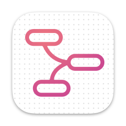
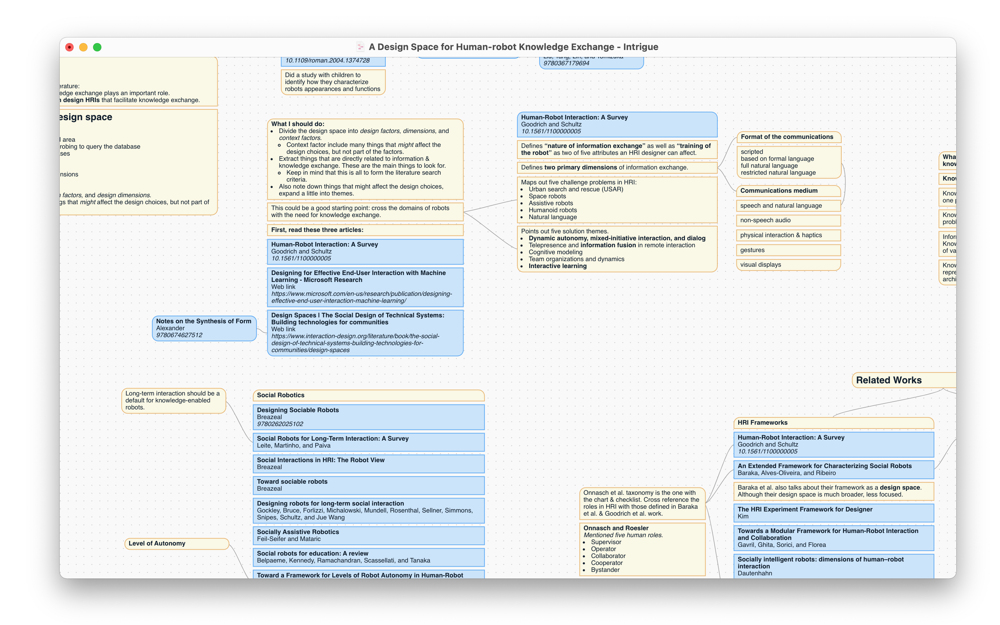

  

<h3 align="center">Intrigue</h3>

Organize literature into ideas, fast.

  <a href="https://github.com/shaunabanana/intrigue/releases/tag/v0.1.5">Download Demo (v0.1.5)</a> | <a href="https://github.com/shaunabanana/intrigue/issues">Report Bugs</a>

> NOTE: When you double click Intrigue, macOS will complain that this app is from an unidentified developer. So instead, please use Right-click > Open to open Intrigue for the first time.

## What is this?
Intrigue lets you quickly organize the papers you read alongside your thoughts in a visual & clean manner.
Features include:
* Automatically pull metadata of **papers (using DOI), books (using ISBN), BibTeX, and web links** using [Citation.js](https://citation.js.org).
* Double clicking reference nodes takes you to a PDF at you-know-where.
* Full **WYSIWYG** markdown support in the notes, powered by [TipTap](https://www.tiptap.dev).
* Everything can be **grouped, snapped, and connected**.
* _COMING SOON: Import BibTeX files exported from a literature search or other tools like Zotero._
* _COMING SOON: Export papers into a BibTeX to directly use in your paper-writing process._

Here's a screenshot of my work-in-progress research canvas:

## How to use?
It's simple!
* **Create notes:** Double click to create a note.
  * Enter an DOI, ISBN, or URL into a note to have it automatically turned into a "reference note" (blue).
  * Double click the note again the edit. Or for a reference note, go to a site for PDF ;)
* **Snap notes:** Drag one note onto another to snap them together.
* **Connect notes:** Select a note, hold Command and click other notes to connect.
  * Click again to disconnect.
* **Pan canvas:** Hold space to pan the canvas.

## I found a bug!
Please file an issue [here](https://github.com/shaunabanana/intrigue/issues), or email me at shengchenzhang1207@gmail.com.

## Support me

